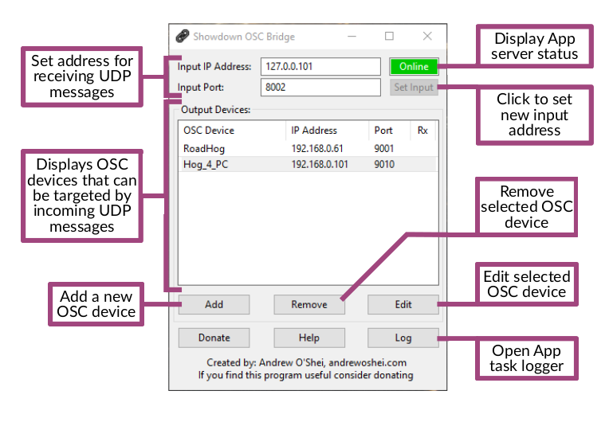
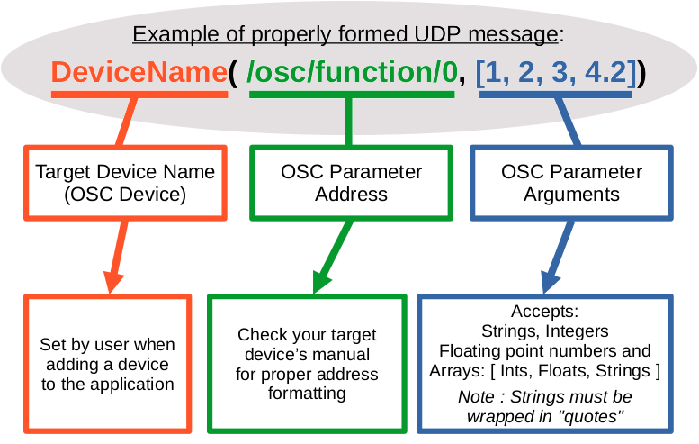

# Showdown OSC Bridge
The Showdown OSC Bridge is a utility program for converting standard UDP message strings into OSC protocol (Open Sound Control) messages. It is also capable of routing signals to multple OSC devices simultaneously. This was created to facilitate the integration of OSC based devices into show control systems that lacked OSC functionality. This app is a useful utility for technicians and engineers who work in theatre and live events production.

I created the app when I found myself in a situation where I couldn't interface a lighting console with a central show control system. Originally designed for personal use I've received enough requests for it that I decided to rework the app a little bit and release it.

## Feature Notice:
**Linking:**
The Showdown OSC app now allows linking between Output (OSC) Devices. Please note, this change is not yet reflected in the help documents.

*So what is linking and how does it work ?*

Linking allows messages to be repeated automatically across mutiple Outputs.
```
Condition-> Device_2 is linked to Device_1
   Result-> All messages received by Device_1 will be repeated on the output of Device_2
```
If you wish to repeat messages across more than two devices you can chain links.
```
Condition-> Device_2 linked with Device_1
Condition-> Device_3 linked with Device_2
Condition-> Device_4 linked with Device_3
   Result-> All messages received by Device_1 will be repeated on Device_2, Device_3 and Device_4
```

**_What if I don't want a message repeated / linked ?_**

You can override the Linking function by adding an optional tag at the end of your UDP message.
```
Message normal:      Device_1(/device/parameter/2, 1.0)
Non-Linking Message: Device_1(/device/parameter/2, 1.0, false)
```




